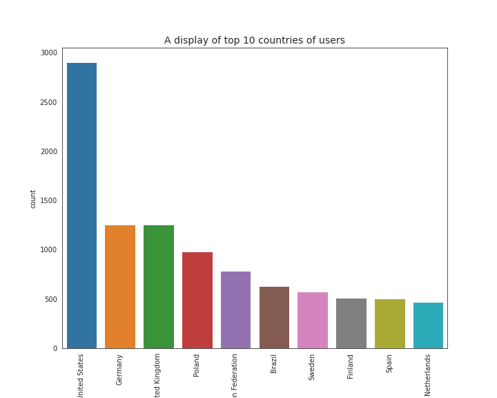
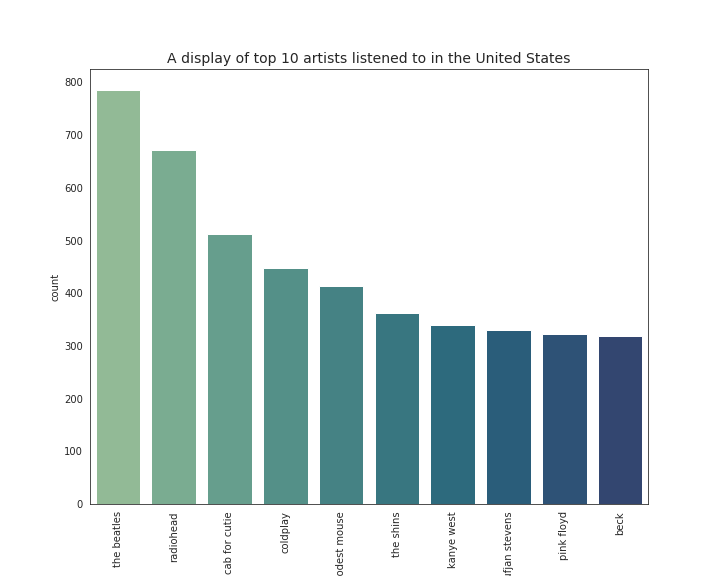
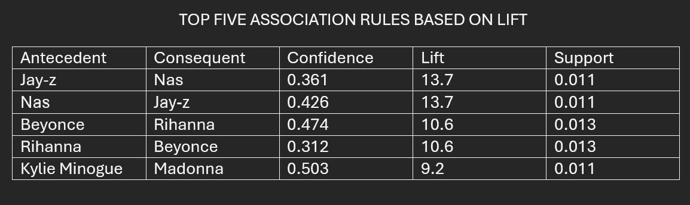
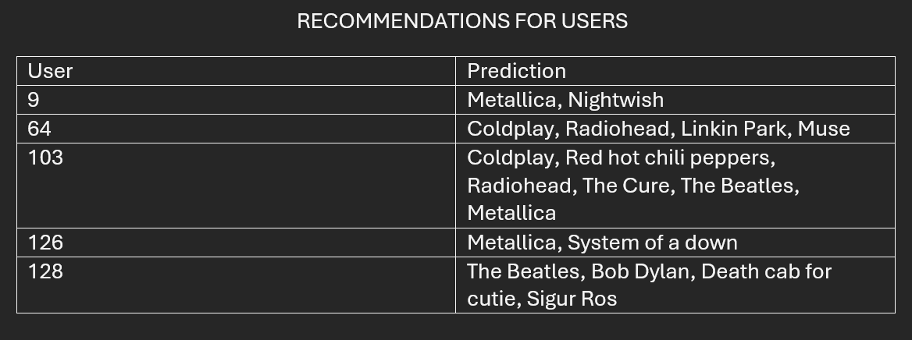

# Music Recommendation System Using FP-Growth

## Project Overview:

Developed a music recommendation system using the FP-Growth algorithm to identify listening patterns and recommend songs to users.

## Business Problem:

Streaming platforms require personalized recommendations to improve user engagement and satisfaction.

## Tools Used:

- Python
- PySpark
- SQL
- Jupyter Notebook

## Methodology:

1. Data preprocessing
2. Exploratory analysis
3. FP-Growth implementation
4. Association rule generation
5. Recommendation creation

## Results:

- Recommendation coverage: 93.93%
- Successfully generated personalized recommendations for users based on listening behavior.

## Visualizations

### Top 10 Count of user's nationalities

### Top 10 Most-Streamed Artists in the U.S.

### Frequent Itemsets

### Association Rules

### Recommendation Example

## Future Improvements

- Hybrid recommendation system
- Collaborative filtering
- Real-time recommendation pipeline
